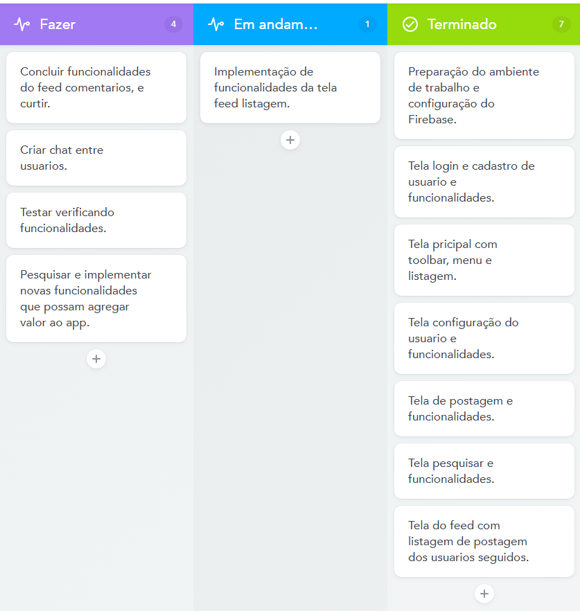

# AmigoPet

Olá a todos, hoje eu gostaria de apresentar a vocês o nosso novo aplicativo de adoção de animais. Nosso objetivo é ajudar as pessoas a encontrar animais de estimação para adotar e reduzir o número de animais abandonados nas ruas. 

O aplicativo apresenta várias funcionalidades úteis, incluindo uma pesquisa de animais, perfis detalhados de animais, uma lista de favoritos e um guia completo para o processo de adoção. Com o aplicativo, os usuários podem facilmente encontrar animais disponíveis para adoção, salvar seus favoritos e obter informações valiosas sobre o processo de adoção.

Ao usar nosso aplicativo, os usuários podem facilitar a adoção de animais, obter informações úteis sobre cuidados com animais de estimação e ajudar a reduzir o número de animais abandonados nas ruas. A adoção de animais é uma maneira maravilhosa de fazer a diferença na vida de um animal e também enriquecer a vida de uma pessoa com a companhia de um animal de estimação.

Em resumo, nosso aplicativo de adoção de animais é uma ferramenta útil para quem procura um animal de estimação para adotar. Ao ajudar a facilitar o processo de adoção e fornecer informações valiosas, esperamos ajudar a promover a adoção de animais e melhorar a vida dos animais abandonados. Obrigado por sua atenção e esperamos que você considere usar nosso aplicativo na sua busca por um novo companheiro animal.

# Desenvolvimento 

- O APP AmigoPet esta sendo desenvolvido por mim como um projeto da disciplina de extenção do curso de Analise e Desenvolvimento de Sistemas da universidade Unifil de Londrina Parana.
Na aplicação estou utilizando o Android Studio e linguagem Java e o Firebase para persistencia dos dados.
- No momento o desnvolvimento está como aparece na imagem a seguir.

# Em execução
- No momento estou trabalhando no desenvolvimento e implantação de funcionalidades fo feed conforme evolução será atualizado aqui.

